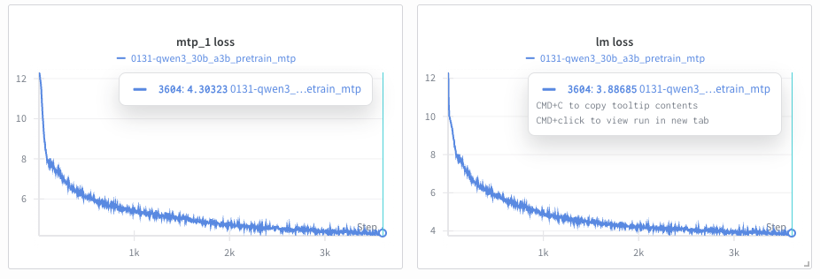
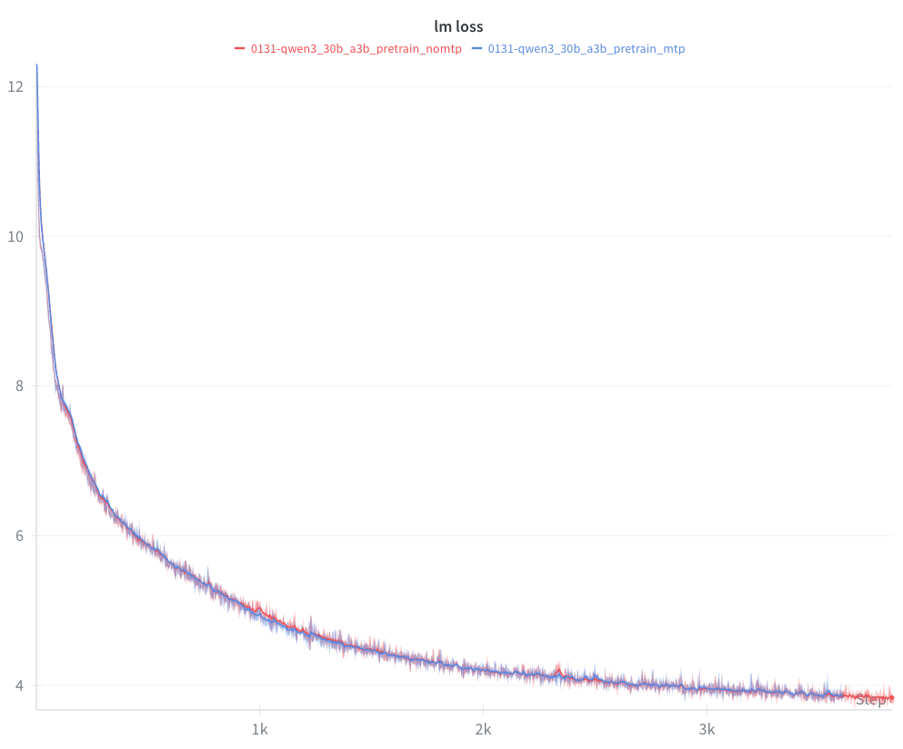

# Multi-Token Prediction (MTP)

## Overview

Multi-Token Prediction (MTP) is an advanced training technique introduced in the [DeepSeek-V3 Technical Report](https://arxiv.org/abs/2412.19437) that enables models to predict multiple future tokens simultaneously during pre-training. Instead of learning to predict only the next token at each position, MTP adds auxiliary prediction heads that predict tokens 2, 3, or more positions ahead.

### Key Benefits

- **Densified Training Signals**: Multiple learning signals per training iteration improve data efficiency
- **Pre-Planning Representations**: Models learn internal representations that encode information about future tokens
- **Speculative Decoding Foundation**: MTP-trained models can serve as foundation for faster inference via speculative decoding

### When to Use MTP

MTP is most beneficial for:

- **Large-scale pre-training** (models > 10B parameters)
- **Data-constrained scenarios** where maximizing learning from limited data is critical
- **Training foundation models** intended for downstream fine-tuning or speculative decoding

MTP is primarily used for pre-training.

### Additional Resources

- [DeepSeek-V3 Technical Report](https://arxiv.org/abs/2412.19437) - Original paper introducing MTP
- [DeepSeek-V3 GitHub](https://github.com/deepseek-ai/DeepSeek-V3) - Official implementation
- [Megatron Core MTP Guide](https://github.com/NVIDIA/Megatron-LM/blob/main/docs/user-guide/features/multi_token_prediction.md) - Low-level implementation details

## Configuration Parameters

MTP is controlled by two primary parameters:

| Parameter | Type | Default | Description | Typical Range |
|-----------|------|---------|-------------|---------------|
| `mtp_num_layers` | int | `None` (disabled) | Number of auxiliary prediction depths. Each layer predicts tokens N positions ahead (N=1,2,...,mtp_num_layers). | 1-2 |
| `mtp_loss_scaling_factor` | float | `0.1` | Weight applied to MTP losses relative to main next-token loss. Controls the contribution of auxiliary predictions to the total loss. | 0.05-0.2 |

### Loss Calculation

The total training loss combines the main next-token prediction loss with averaged MTP losses:

```
total_loss = main_loss + (avg_mtp_loss * mtp_loss_scaling_factor)

where:
  avg_mtp_loss = mean([mtp_1_loss, mtp_2_loss, ..., mtp_N_loss])
```

### Parameter Tuning Guidelines

**`mtp_num_layers`:**
- Start with `1` for most models (predicts 1 token ahead)
- Use `2` for models > 100B parameters if memory allows
- Higher values increase memory usage and training time proportionally

**`mtp_loss_scaling_factor`:**
- Default `0.1` works well for most models
- Increase to `0.15-0.2` if MTP losses aren't decreasing
- Decrease to `0.05-0.08` if main loss is being overshadowed
- Scale factor should be proportional to `mtp_num_layers` (more layers → lower factor)

## Basic Usage: Training from Scratch

### Minimal Configuration Example

Here's a minimal example using the Qwen3 30B-A3B recipe with MTP enabled:

```python
from megatron.bridge.recipes.qwen.qwen3_moe import qwen3_30b_a3b_pretrain_config
from megatron.bridge.training.pretrain import pretrain
from megatron.bridge.training.gpt_step import forward_step
from megatron.bridge.training.config import ConfigContainer

log_dir = "/path/to/log/dir"
cfg: ConfigContainer = qwen3_30b_a3b_pretrain_config()
cfg.logger.tensorboard_dir = log_dir + "/tb_logs"
cfg.checkpoint.save = log_dir + "/checkpoints"
cfg.checkpoint.load = log_dir + "/checkpoints"
# Set up training dataset
cfg.dataset.blend=[[
    f"/path/to/dclm/preprocessed/dclm_{i:02d}_text_document"
    for i in range(1, 11)
], None]
cfg.dataset.split="9999,8,2"
cfg.dataset.path_to_cache = "/path/to/cache"
# cfg.model.num_layers = 8  # train a smaller model if OOM
# MTP Configuration
cfg.model.mtp_num_layers = 1
cfg.model.mtp_loss_scaling_factor = 0.1
pretrain(cfg, forward_step)
```
Follow the [DCLM Tutorial](https://github.com/NVIDIA-NeMo/Megatron-Bridge/tree/main/tutorials/data/dclm) to prepare the training data 


## MTP with Pipeline Parallelism

When using Pipeline Parallelism (PP), **MTP layers must be placed in the last pipeline stage** alongside the loss computation layer. Configure this using custom pipeline layout settings (`pipeline_model_parallel_split_rank`).

### Pipeline Layout Guidelines

MTP layers take approximately the same training time as a regular transformer layer. When configuring your pipeline layout:

- **Place MTP in the last PP stage** (required for correct loss computation)
- **Reduce layers in other PP ranks** to balance computation time across stages
- Example: For a 21-layer model with PP=4 and `mtp_num_layers=1`, you might use splits like `[5, 6, 6, 4]` instead of `[5, 5, 5, 6]` to account for MTP overhead in the last stage


## Parallelism Support

MTP is compatible with all major parallelism strategies in Megatron-Bridge:

| Parallelism Type | Support Status | Notes |
|------------------|----------------|-------|
| **Tensor Parallelism (TP)** | ✅ Fully Supported | MTP layers are automatically sharded across TP ranks |
| **Pipeline Parallelism (PP)** | ✅ Supported with Constraint | MTP must be in last pipeline stage (see above) |
| **Expert Parallelism (EP)** | ✅ Fully Supported | Works with MoE models (DeepSeek-V3, Mixtral, etc.) |
| **Context Parallelism (CP)** | ✅ Fully Supported | MTP supports long-context training via CP |
| **Data Parallelism (DP)** | ✅ Fully Supported | Standard data parallelism works transparently |

## Monitoring MTP Training

### Per-Layer Loss Logging

During training, you'll see losses for each MTP depth logged separately:

```
iteration      100/  300000 | consumed samples:         3200 | elapsed time per iteration (ms): 3738.6 | learning rate: 6.000000E-05 | global batch size:    32 | lm loss: 7.968678E+00 | load_balancing_loss: 1.329517E+00 | mtp_1 loss: 7.925096E+00 | loss scale: 1.0 | grad norm: 1.040 | number of skipped iterations:   0 | number of nan iterations:   0 |
```

### Interpreting Loss Values



The figure above shows typical training curves for MTP-enabled training:
- **Left**: MTP auxiliary loss (`mtp_1 loss`) tracking the first additional token prediction
- **Right**: Main language model loss (`lm loss`) for standard next-token prediction

**Expected Patterns:**

- **MTP losses are higher than main loss**: Predicting tokens further in the future is inherently harder. In the example above, `mtp_1 loss` (~4.3) is higher than `lm loss` (~3.9) at 3500 iterations.

- **All losses decrease over training**: Both main and MTP losses should trend downward, as shown in the curves above.

- **Loss gap remains relatively stable**: The difference between main and MTP losses should not grow significantly over training.

**Red Flags:**

- **NaN values**: Indicates training instability (see Troubleshooting section)
- **Diverging losses**: If MTP losses increase while main loss decreases, reduce `mtp_loss_scaling_factor`
- **Widening gap**: If MTP losses fall behind by > 1.0, increase `mtp_loss_scaling_factor`

**MTP vs Non-MTP Comparison:**



The figure above compares `lm loss` between MTP-enabled (blue) and non-MTP (red) training runs on Qwen3-30B-A3B. The curves do not differ significantly in the first few thousand iterations. Notably, the MTP-enabled run shows smoother behavior around iterations 1000 and 2300, where the non-MTP run exhibits more pronounced spikes.

### TensorBoard/WandB Visualization

MTP losses are automatically logged to TensorBoard and/or WandB. Look for:

- `lm loss` - Main next-token prediction loss
- `mtp_1 loss` - First auxiliary prediction loss
- `mtp_2 loss` - Second auxiliary prediction loss (if `mtp_num_layers=2`)

### Training Characteristics

- MTP adds computational overhead due to additional forward passes
- Memory usage increases proportionally to `mtp_num_layers`
- MTP is designed to improve data efficiency during pre-training

**Model Performance:**

- MTP provides additional training signals at each token position
- Can potentially improve downstream task performance
- MTP-trained models can be used for speculative decoding during inference

## Current Limitations

The following features are not yet supported with MTP:

| Feature | Status | Workaround |
|---------|--------|------------|
| **HuggingFace ↔ Megatron Checkpoint Conversion** | ⚠️ Model-specific | Conversion support varies by model; check model-specific documentation |
| **Sequence Packing (Fine-Tuning)** | ❌ Not supported | For pre-training, no issues. For fine-tuning, set `packed_sequence_specs=None` |
| **Cross-Attention** | ❌ Not supported | MTP only works with decoder-only models (GPT, Llama, etc.) |
| **Learned Absolute Position Embeddings** | ❌ Not supported | Use RoPE (rotary position embeddings) or no position embeddings |
| **Block-Based Activation Recomputation** | ❌ Not supported | Use `recompute_granularity="selective"` or `"uniform"` |

### Important Notes

**Checkpoint Conversion:**

HuggingFace ↔ Megatron checkpoint conversion with MTP is model-specific. Some models have conversion support planned, while others may not support MTP parameter mapping. Check the documentation for your specific model.

**Sequence Packing:**

MTP is incompatible with fine-tuning sequence packing (e.g., SFT with packed sequences). For pre-training, there are no sequence packing restrictions.

## Troubleshooting Guide

### Error: Out of Memory (OOM)

MTP increases memory usage proportionally to `mtp_num_layers`. Try:
- Reduce `mtp_num_layers` to 1
- Enable activation recomputation: `recompute_granularity="selective"`
- Increase pipeline parallelism
- Reduce micro batch size

### Error: MTP Loss is NaN

Training instability. Try:
- Lower learning rate
- Enable gradient clipping: `clip_grad=1.0`
- Use BF16 instead of FP16
- Reduce `mtp_loss_scaling_factor` to 0.05

### Expected Log: `MTP layers not found on this PP rank`

This is normal. Only the last pipeline stage builds MTP layers.

## Additional Resources

### Code Examples

- **DeepSeek-V3 Recipe**: [`src/megatron/bridge/recipes/deepseek/deepseek_v3.py`](../../src/megatron/bridge/recipes/deepseek/deepseek_v3.py)
  - Example of MTP with large-scale MoE model
  - Predefined pipeline layouts for PP + MTP

- **Qwen3-Next Recipe**: [`src/megatron/bridge/recipes/qwen/qwen3_next.py`](../../src/megatron/bridge/recipes/qwen/qwen3_next.py)
  - Clean example of MTP configuration for dense models
  - Good starting point for custom recipes

- **MTP Core Implementation**: [`3rdparty/Megatron-LM/megatron/core/transformer/multi_token_prediction.py`](../../3rdparty/Megatron-LM/megatron/core/transformer/multi_token_prediction.py)
  - Low-level MTP layer implementation
  - Loss computation and logging helpers

### Documentation

- **Megatron Core MTP Guide**: [`3rdparty/Megatron-LM/docs/user-guide/features/multi_token_prediction.md`](https://github.com/NVIDIA/Megatron-LM/blob/main/docs/user-guide/features/multi_token_prediction.md)
  - Implementation notes and design decisions

- **Pipeline Parallelism Guide**: [`docs/parallelisms.md`](../parallelisms.md)
  - Understanding pipeline parallelism layouts
  - Best practices for PP configuration

### External Resources

- **DeepSeek-V3 Technical Report**: [https://arxiv.org/abs/2412.19437](https://arxiv.org/abs/2412.19437)
  - Original paper introducing MTP
  - Section 3.2: "Multi-Token Prediction"
  - Training details and ablation studies

- **DeepSeek-V3 GitHub**: [https://github.com/deepseek-ai/DeepSeek-V3](https://github.com/deepseek-ai/DeepSeek-V3)
  - Official implementation and model weights
  - Training configurations and hyperparameters

- **Megatron-LM GitHub**: [https://github.com/NVIDIA/Megatron-LM](https://github.com/NVIDIA/Megatron-LM)
  - Upstream Megatron-Core implementation
  - Issues and discussions

### Getting Help

If you encounter issues not covered in this guide:

1. Check the [Megatron-Bridge GitHub Issues](https://github.com/NVIDIA-NeMo/Megatron-Bridge/issues)
2. Review the [Megatron-LM Discussions](https://github.com/NVIDIA/Megatron-LM/discussions)

When reporting issues, include:
- Full training configuration (recipe and parameters)
- Error messages and stack traces
- GPU type and count
- Megatron-Core version (`pip show megatron-core`)
